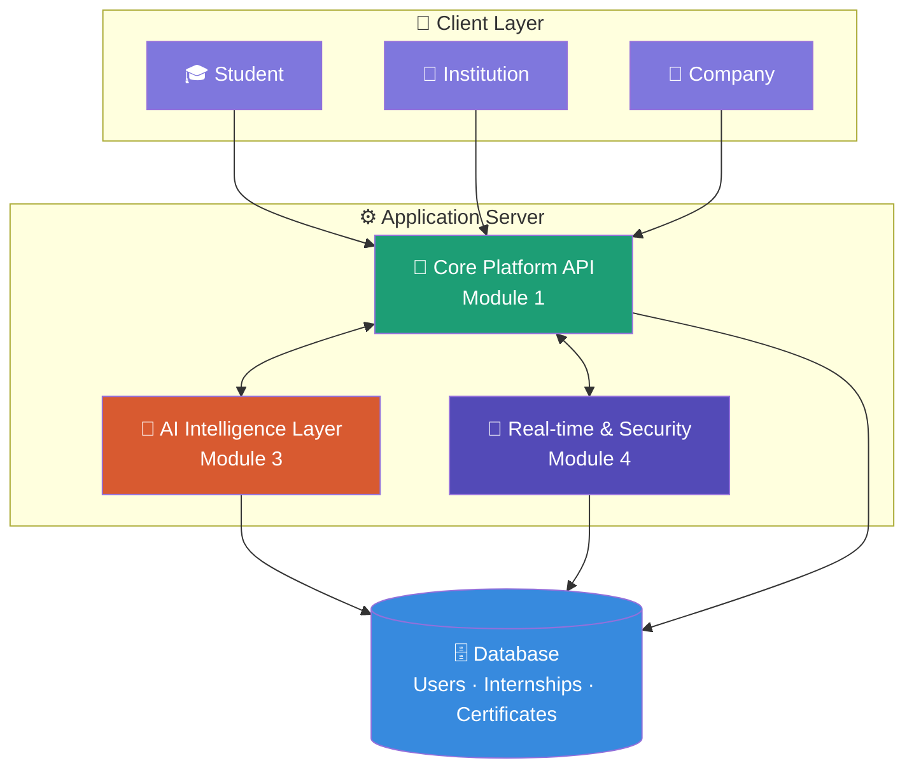
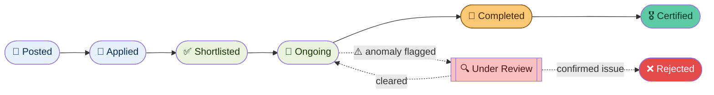
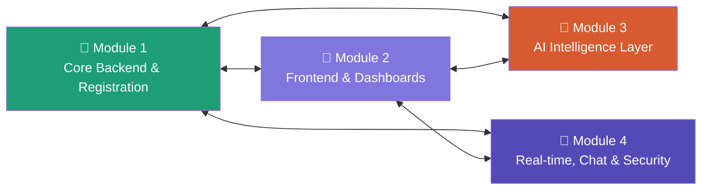
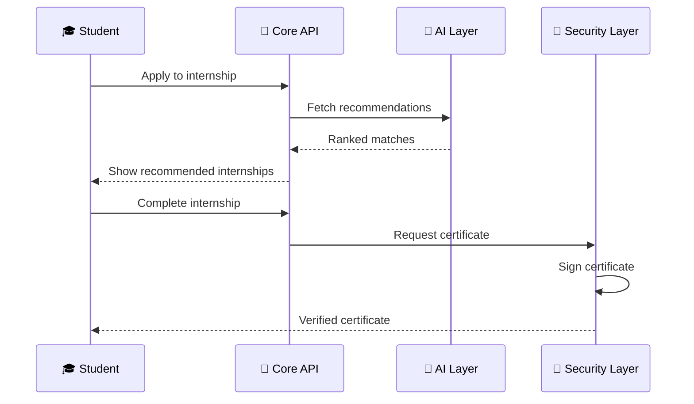

# Smart Internship Management System — Module 1

Complete PostgreSQL + Node.js/Express backend for Module 1.

Features: registration/login, bcrypt password hashing, JWT authentication, RBAC, student/company/institution profiles, internship CRUD, applications and status lifecycle, certificates and verification.

## Setup
1. Create database `smart_internship` in PostgreSQL/pgAdmin.
2. Run `database/schema.sql` inside that database.
3. In `backend`, copy `.env.example` to `.env` and enter your PostgreSQL password and a JWT secret.
4. Run `npm install`.
5. Run `npm run dev`.
6. Open `http://localhost:5000`.

## Auth
POST `/api/auth/register`
```json
{"name":"Test Student","email":"student@test.com","password":"123456","role":"STUDENT"}
```
POST `/api/auth/login`
```json
{"email":"student@test.com","password":"123456"}
```
Use returned token as `Authorization: Bearer <token>` for protected APIs.

## Main APIs
- Profiles: `/api/students/profile`, `/api/companies/profile`, `/api/institutions/profile`
- Internships: `/api/internships`
- Applications: `/api/applications`
- Certificates: `/api/certificates`

<div align="center">

# 🌐 InternPulse

### Smart Internship Management & Verification Platform

*Beyond tracking — AI-powered recommendations, fraud detection, and tamper-proof certification for the complete internship lifecycle.*

[](#-tech-stack)
[](#-tech-stack)
[](#-tech-stack)
[](#-license)
[](#-roadmap)

</div>

---

## 📖 Table of Contents

- [Overview](#-overview)
- [Why InternPulse](#-why-internpulse)
- [Architecture](#-architecture)
- [Internship Lifecycle](#-internship-lifecycle)
- [Modules](#-modules)
- [Tech Stack](#-tech-stack)
- [Repository Structure](#-repository-structure)
- [Getting Started](#-getting-started)
- [API Overview](#-api-overview)
- [Security & Privacy](#-security--privacy)
- [Team](#-team)
- [Roadmap](#-roadmap)
- [License](#-license)

---

## 🚀 Overview

**InternPulse** is a full-stack platform that digitally manages and monitors the complete internship lifecycle — from posting to certification — for institutions, companies, and students, on a single secure platform.

What makes it different from a standard internship tracker:

| 🎯 Standard systems | ✨ InternPulse |
|---|---|
| Manual application tracking | AI-driven skill-to-internship matching |
| Static certificates | Cryptographically signed, tamper-proof certificates |
| No fraud safeguards | AI fraud & authenticity detection on submitted work |
| Basic messaging (or none) | End-to-end encrypted student ↔ company chat |
| One-size dashboard | 3 tailored dashboards — student, institution, company |

---

## 💡 Why InternPulse

AI-generated fake certificates and proxy internships are a growing, actively-researched problem in 2026 — recruiters and institutions increasingly can't trust that a "completed" internship was genuinely done by the person claiming it. InternPulse builds verification and integrity into the platform from day one, instead of bolting it on later.

---

## 🏗 Architecture



---

## 🔄 Internship Lifecycle



---

## 🧩 Modules

Four modules, four owners, one platform.



<details>
<summary><strong>🧱 Module 1 — Core Backend, Registration & Data Foundation</strong></summary>

- Multi-role auth (student / institution / company) with RBAC
- Internship posting → application → approval workflow
- Central REST API consumed by every other module
- Owns the database schema

</details>

<details>
<summary><strong>🎨 Module 2 — Frontend & Dashboards</strong></summary>

- Student, institution, and company dashboards
- Resume builder, active-internship browsing, progress analytics
- Certificate download UI
- Chatbot, notification, and messaging UI shells

</details>

<details>
<summary><strong>🤖 Module 3 — AI Intelligence Layer</strong></summary>

| Sub-service | Purpose |
|---|---|
| `recommendation-engine` | Skill-to-internship matching + skill-gap analysis |
| `chatbot` | Student FAQ assistant with escalation |
| `grievance-system` | AI-triaged complaint/dispute handling |
| `feedback-analysis` | Sentiment analysis on company feedback |
| `fraud-detection` | AI-content & activity anomaly detection *(advisory only)* |

✅ All 5 sub-services implemented and passing their test suites.

</details>

<details>
<summary><strong>🔐 Module 4 — Real-time, Communication & Security</strong></summary>

- Real-time notifications (WebSockets)
- **End-to-end encrypted** student ↔ company messaging — no institution/admin access to message content
- Weekly progress reminders
- Document verification + cryptographically signed certificates

</details>

---

## 🛠 Tech Stack

<div align="center">


</div>

| Layer | Technology |
|---|---|
| Frontend | React, Tailwind CSS, Recharts |
| Core backend | Node.js, Express, MongoDB / PostgreSQL |
| AI microservices | Python, FastAPI, scikit-learn, LLM API |
| Real-time | Socket.IO, Redis, BullMQ |
| Security | JWT, bcrypt, Web Crypto API / libsodium |

---

## 📁 Repository Structure

```
internpulse/
├── core-backend/            # Module 1 — auth, internships, API
├── frontend/                 # Module 2 — dashboards
├── module3/                  # Module 3 — AI services
│   ├── recommendation-engine/
│   ├── chatbot/
│   ├── grievance-system/
│   ├── feedback-analysis/
│   └── fraud-detection/
├── realtime-security/        # Module 4 — sockets, messaging, certs
└── README.md
```

---

## ⚡ Getting Started

```bash
# Clone the repo
git clone https://github.com/<your-org>/internpulse.git
cd internpulse

# Core backend
cd core-backend && npm install && npm run dev

# Frontend
cd ../frontend && npm install && npm run dev

# Any AI microservice (example: recommendation engine)
cd ../module3/recommendation-engine
python -m venv venv && source venv/bin/activate
pip install -r requirements.txt
uvicorn app.main:app --reload --port 8001
```

Each module folder has its own README with setup steps specific to that service.

---

## 🔌 API Overview



---

## 🔒 Security & Privacy

- 🔐 Student ↔ company messages are **end-to-end encrypted** — not even platform admins can read message content
- 🛡️ Certificates are cryptographically signed and independently verifiable
- ⚠️ Fraud/anomaly detection is **advisory only** — it flags for human review, never auto-rejects

---

## 👥 Team

| Member | Module |
|---|---|
| *(assign name)* | Module 1 — Core Backend |
| *(assign name)* | Module 2 — Frontend & Dashboards |
| *(assign name)* | Module 3 — AI Intelligence Layer |
| *(assign name)* | Module 4 — Real-time & Security |

---

## 🗺 Roadmap

- [x] Module 3 AI microservices — implemented & tested
- [ ] Module 1 core backend & database schema
- [ ] Module 2 dashboards
- [ ] Module 4 real-time & encrypted messaging
- [ ] End-to-end integration across all 4 modules
- [ ] Deployment

---

## 📄 License

This project is licensed under the MIT License.

<div align="center">

**Built with ⚡ by the InternPulse team**

</div>
